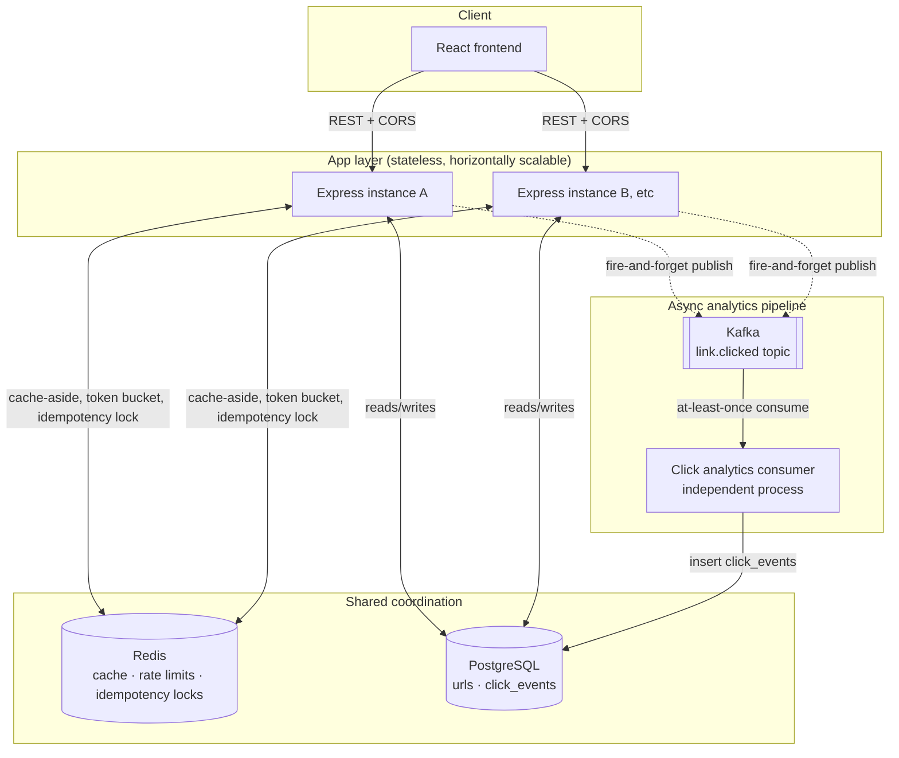

# shortly — a distributed URL shortener

A production-patterned URL shortener built to learn (and demonstrate) the system design concepts that show up in real backend interviews: caching, idempotency, rate limiting, distributed ID generation, and async event-driven analytics — not just a CRUD app with a database.

Built with **Node.js, TypeScript, Express, PostgreSQL, Redis, Kafka, and React**.

---

## Architecture



**Why it's drawn this way:** the app layer has no shared memory between instances — every piece of cross-instance coordination (rate limit buckets, idempotency locks, cached redirects) happens through Redis, not through the app processes talking to each other directly. The click-analytics pipeline is fully decoupled: the producer (inside the redirect request) and the consumer (a separate long-running process) share nothing but the Kafka topic between them, so either can be down without breaking the other.

---

## What's actually implemented

| Concept | Where | Why it's there |
|---|---|---|
| **Counter → Snowflake ID generation** | `utils/snowflake.ts` | Moved ID generation from a network round-trip to Postgres to a fully in-process, coordination-free scheme — each instance generates guaranteed-unique IDs using its own worker ID + timestamp + sequence |
| **Cache-aside caching** | `repositories/url.cache.ts` | Redirects check Redis before Postgres; negative caching protects against repeated lookups of nonexistent codes |
| **Idempotency keys** | `utils/idempotency.ts` | Redis `SET NX` lock + cached replay prevents duplicate short URLs from retried requests, backed by a Postgres unique constraint as a second line of defense |
| **Rate limiting** | `utils/tokenBucket.ts` | Token bucket algorithm via an atomic Redis Lua script — avoids the race condition of separate GET/SET round-trips under concurrency |
| **Kafka click pipeline** | `config/kafka.ts`, `consumer.ts` | Redirect requests publish click events fire-and-forget; a fully independent consumer process aggregates them, so analytics can never slow down or break a redirect |
| **Structured logging** | `config/logger.ts` | `pino`-based JSON logs with per-request IDs, traceable across the full request lifecycle |
| **Prometheus metrics** | `config/metrics.ts`, `GET /metrics` | Request counts, latency histograms, cache hit/miss counters — real exposition format, not a custom JSON stub |

All of the above were verified against **real running Redis, Postgres, and (where possible) Kafka** during development — including proving the idempotency lock and rate limiter behave correctly under genuine concurrent load, and across multiple independently-running server processes sharing no memory.

---

## Performance

Measured locally with `autocannon` and `redis-cli`-driven cache-flush trials (scripts in `backend/scripts/`).

| Test | Result | Method |
|---|---|---|
| **Cache latency** | **42.2% reduction** (12.08ms → 6.98ms avg) | 20 trials each, flushing Redis before each cache-miss trial |
| **Rate limit enforcement** | **99.8% of a burst blocked** (9 allowed / 4,067 fired in 5s, bucket capacity 5, refill 1/sec) | `autocannon`, 20 concurrent connections |
| **Rate limiter under sustained load** | Correctly throttled 24,122 of 24,251 requests (129 successful redirects) over 10s | `autocannon`, 50 concurrent connections against the redirect endpoint's default limits |

> Re-run these yourself with `npm run benchmark:cache`, `npm run benchmark:ratelimit`, and `npm run benchmark:throughput` inside `backend/`. Numbers will vary by machine — that's expected; the scripts and methodology are what matter for reproducibility.

---

## Project structure

```
distributed-url-shortener/
├── backend/          Express + TypeScript API, Kafka consumer, benchmarks
├── frontend/          React + TypeScript + Vite UI
└── README.md          you are here
```

See `backend/README.md` and `frontend/README.md` for setup instructions specific to each half.

## Quick start

```bash
# 1. Start Postgres, Redis, and Kafka
cd backend && docker-compose up -d

# 2. Start the API
cp .env.example .env && npm install && npm run dev

# 3. Start the click-analytics consumer (separate terminal)
npm run consumer

# 4. Start the frontend (separate terminal)
cd ../frontend && cp .env.example .env && npm install && npm run dev
```

Open http://localhost:5173.

## API reference

| Endpoint | Description |
|---|---|
| `POST /api/v1/shorten` | Create a short URL. Accepts `Idempotency-Key` header. |
| `GET /:shortCode` | Redirects to the original URL. |
| `GET /api/v1/urls/:shortCode/stats` | Total click count for a short URL. |
| `GET /health` | Liveness check. |
| `GET /metrics` | Prometheus metrics. |

---

## What this project deliberately doesn't have (yet)

- **No user accounts/auth** — "recent links" are stored client-side per browser, not server-side per user. Adding real accounts is a separate, larger feature.
- **No production deployment** — currently runs locally via Docker Compose. Cloud deployment (AWS: RDS, ElastiCache, self-hosted Kafka on EC2, ALB) is a planned next phase.
- **At-least-once, not exactly-once, click processing** — a consumer crash between processing and offset-commit can duplicate a click count. Acceptable for approximate analytics; would need idempotent writes or Kafka transactions to close fully.